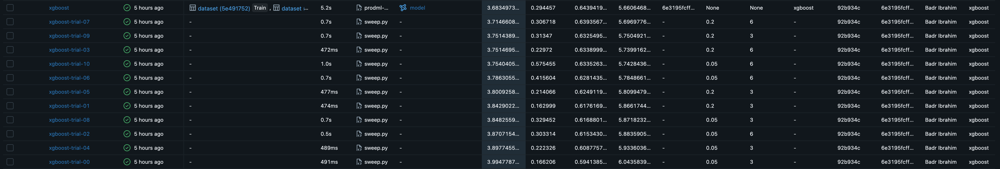
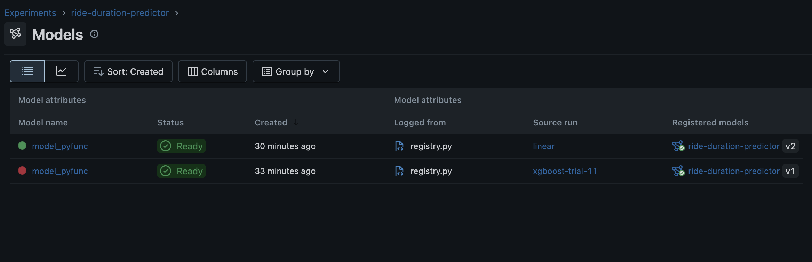
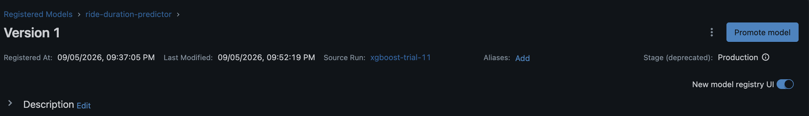

# Module 2 Report

## Step 02 — Track three model families properly

**Identical splits** (temporal): train `green_tripdata_2024-11.parquet` · validation `green_tripdata_2024-12.parquet` — same cleaning + features for every run.


### Family baselines

| family | params | RMSE | MAE | R² |
|---|---|---|---|---|
| xgboost | defaults | 5,66 | 3,68 | 0,64 |
| linear | - | 5,93 | 3,79 | 0,60 |
| mlp (pytorch) | hidden 64 · epochs 10 · lr 1e-3 · batch 2048 | 7,26 | 4,40 | 0,41 |


### XGBoost sweep — 12 nested trials

Best trial: `n_estimators=200, max_depth=6, learning_rate=0.2` → RMSE 5,64 · MAE 3,66 · R² 0,647
Worst trial: `0` → MAE 3,99
vs xgboost default baseline: MAE 3,68

tuning gain = (baseline MAE − best MAE) / baseline MAE × 100% 
 = (3,68 - 3,66) / 3,68 x 100%
 = **0,54% lower MAE**



### Autolog: free vs manual (2.4)

| captured for free by `mlflow.xgboost.autolog()` | had to log manually |
|---|---|
| full model params | validation metrics (RMSE/MAE/R² — autolog needs `eval_set`) |
| model artifact with flavor + env | tags (git_commit, data_version, author, framework) |
| dataset record | residual + feature-importance plots, train duration, model size, requirements.txt |


## Step 03 — Model registry and the promotion lifecycle

Best run (xgboost trial 11, MAE 3.66) registered as `ride-duration-predictor`:
**v1** walked None → Staging → Production. Worse model (linear, MAE 3.79)
registered as **v2**, left in None for contrast.

`predict.py` loads by stage URI, never by file path:

```python
mlflow.pyfunc.load_model("models:/ride-duration-predictor/Production")
```






## Step 04 — Version your data with DVC

**Versioning proof (observed):** `<FILL — the checkout → dvc checkout → revert observation>`

**Pipeline:** `pipelines/dvc.yaml` with stages prepare → featurize → train → evaluate, each declaring deps, params, outs (evaluate also metrics).

**Caching:** second unchanged `dvc repro` → all stages skipped ("didn't change").

**Params change:** `params.yaml` `max_depth: 6 → 8` → train + evaluate re-ran only; prepare/featurize cached.

**Metrics** (`dvc metrics show`):

| params | RMSE | MAE | R² |
|---|---|---|---|
| max_depth=6 | 5.63544 | 3.66251 | 0.64711 |
| max_depth=8 | 5.60001 | 3.63114 | 0.65153 |

`dvc metrics diff` (8 vs 6): MAE −0.03137 · R² +0.00442 · RMSE −0.03543

**Reproducibility:** `dvc repro` (depth 6) reproduced MLflow trial 11's MAE exactly — 3.66251.

**Lineage:** `data_version` tag on every run = DVC hash of the training parquet (`6e3195fcff081dbdb5b8774166ca1b3d`); model → run → hash → exact training bytes.